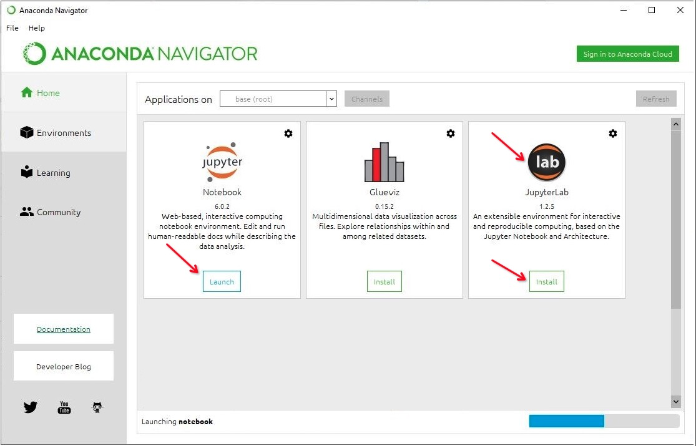
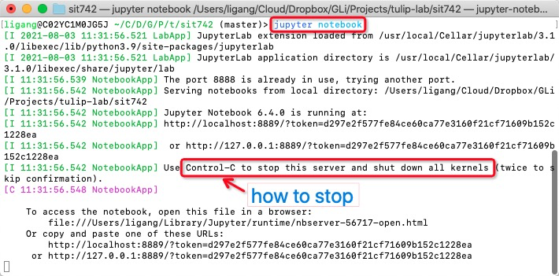
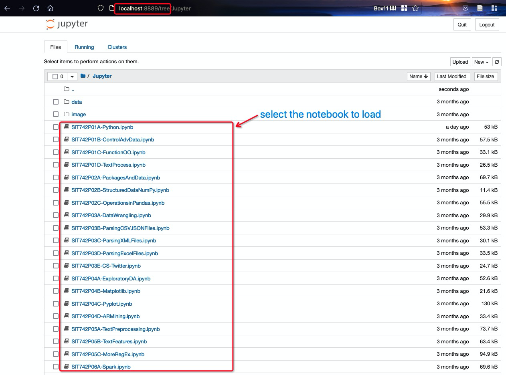

# Self-Hosting `Jupyter`

First, please be aware that you are not recommended self-hosting the server, unless you are familiar with IT system maintenance and `Linux` management. 

>:speaking_head: [Google Colab](M01A-Platforms-I.md) is sufficient for most beginners in data science and `MDS` teaching purpose.

If you decide to self-host the data science platform, please consider:

- You need to install `Python 3` not `Python 2`.
- You need to install `pip`, and understand how to install packages with it.
- `Jupyter`'s website shows how to install the package using a few environment managers like `conda`.
- You don't want to pollute your local environment. 
  >Also, because ML-related packages are quite brittle when it comes to dependencies, you want an environment manager for your packages. Just figuring out which to use will take you a while.

For this part, we only introduce the [`Jupyter`](https://jupyter.org/) notebook environment install and setup. In a later module [M04F-Spark](../M04-DataManipulation/M04F-Spark.md), you will complete this with the installation of [`Apache Spark`](https://spark.apache.org/), which is our selected platform for big data analysis and already available in [`Google Colab`](M01A-Platforms-I.md).

## Self-Hosting `Jupyter` Server on `Windows`/`Mac`

For `Windows`/`Mac` users, the easiest way for a beginner to get started with `Jupyter` notebooks is by installing [`Anaconda`](https://www.anaconda.com/products/individual), which is the most widely used `Python` distribution for data science and comes preloaded with all the most popular libraries and tools. 

To get `Anaconda`, simply:

- Download the latest version of `Anaconda`.
- Install `Anaconda` by following the instructions on the download page and/or in the executable.

After that, you can launch `Jupyter` notebook from `Anaconda Navigator`, as shown in the following figure.

>:information_source: **Optional**: You can install `JupyterLab` from `Anaconda Navigator`.

## Self-Hosting Jupyter Server on Mac/Linux

For `Mac` or `Linux` users, one common package is the [`JupyterLab`](https://jupyter.org/). You can install it by following any of the following online tutorials:

- [`JupyterLab` Official Installation information](https://jupyter.org/install.html)
- [`JupyterLab` on Mac using `homebrew`](https://medium.com/@blessedmarcel1/how-to-install-jupyter-notebook-on-mac-using-homebrew-528c39fd530f)

## Launching `Jupyter notebook` 

Once completed, you can activate the `Jupyter notebook` by typing the command `jupyter notebook` in terminals, as shown in the following figure:

If the installation and configures are completed, you should be able to access the `Jupyter notebooks` in a Web browser:

## What is next?

After this, we move into the `MDS` modules by loading related `Jupyter` notebooks. All SIT742 notebooks are hosted in GitHub, so you can download [them](https://github.com/tulip-lab/sit742) to your local host, and access them from your Jupyter notebook in Web browser.

:movie_camera:

 
- Anaconda
- Link as below: 
https://deakin.zoom.us/rec/share/9oH99q-bUM7lS9-qiAnKuXigq-H3Uf5GecfelWU0Ql4THtcbj7SdFKVyp83IOahY.TXBoKYjWgPgLvKZH?startTime=1635341994000

>

 
>:film_projector: A video is available for the related demonstration.

- [How to install (py)Spark on MacOS (late 2020)](https://maelfabien.github.io/bigdata/SparkInstall/)
- [Install Spark on Windows Laptop for Development](https://www.hackdeploy.com/install-spark-on-windows-laptop-for-development/)
- [How to Run PySpark in a Jupyter Notebook](https://www.hackdeploy.com/how-to-run-pyspark-in-a-jupyter-notebook/)
- 
