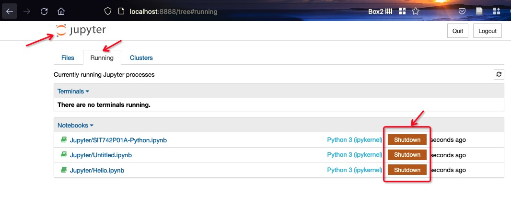

[](../README.md)
[](README.md)

# `Jupyter` Notebooks

`Jupyter Notebook` is an open source web application that you can use to create and share documents that contain live code, equations, visualisations, and text. 

Traditionally, notebooks have been used to document research and make results reproducible, simply by rerunning the notebook on source data. Interactive notebooks are experiencing a rise in popularity, and theyare replacing PowerPoint in presentations, shared around organisations, and they are even taking workload away from many software packages such as `Tableau`, or `Rapidminer`. Why would many data scientists choose to use a notebook instead of a favourite `Programming IDE` or `command line`? 

- What they do offer is an environment for exploration, collaboration, and visualisation. 
- Notebooks are typically used by data scientists for quick exploration tasks, and they can document the code/command in a notebook as you manipulate or analyse your data;. In that regard, they offer a number of advantages over any local scripts or tools. 
- Data Visualisations are rendered directly in the notebook; and dynamic visualisations such as animations are supported;
- Notebooks also tend to be set up in a cloud platform, allowing the data scientist to take advantage of computational resources beyond what is available on the laptop, and operate on the full data set without having to download a local copy.

## Jupyter Notebooks


`IPython notebook` is an `HTML`-based notebook environment which provides a cell-based environment with great interactivity. In 2014, 
a spin-off project from `IPython` called **Project Jupyter** was announced. `Jupyter Notebook` and `JupyterLab` are maintained by the people at Project `Jupyter`.  The name, `Jupyter`, comes from the core supported programming languages that it supports: `Julia`, `Python`, and `R`. `Jupyter` ships with the `IPython` kernel, which allows you to write your programs in `Python`, but there are currently over 100 other kernels that you can also use. So technically, `IPython notebooks` are `Jupyter notebooks` with an `IPython` kernel. Therefore, you will see the `Jupyter` icon on the top of notebook interface. In this unit `MDS`, we refer to the same term when we mention `Jupyter notebook` or `IPython notebook`.  

`Jupyter notebooks` are particularly useful as scientific lab books when you are doing data science using computational tools. Depending on your preferred Python Platforms, you have different ways to launch a `Jupyter` notebook:

- `Google Colab`: you can `new` or `upload` a notebook from the Colab interface; 
> | `Google Colab`  |   `JupyterLab` |
>| :--:            |:--: |
>|||

- `Self-Hosting server`: you can start the `Jupyter notebook` server by keying in the command in a terminal window/command line window.
    ```console
    $ jupyter notebook
    ```

## A tour of `Jupyter notebook`

### Jupyter notebook interface

Now you have created your first notebook, let us have a close look at the user interface of notebook. 

When you open a Jupyter notebook in Web browser, you will be presented with the notebook name, a menu bar, a toolbar and an empty code cell.

| `Google Colab`  |   `JupyterLab` |
| :--:            |:--: |
|||

We can see the following components in a notebook:

- `Title bar` is at the top of the page and contains the name of the notebook. Clicking on the notebook name brings up a dialogue which allows you to rename it. Please rename your notebook name from “Untitled0” to “hello”. This change the file name from Untitled0.ipynb to hello.ipynb.

- `Menu bar` presents different options that can be used to manipulate the way the notebook functions.

- `Toolbar` gives a quick way of performing the most-used operations within the notebook.

- An empty computational cell is show in a new notebook where you can key in your code.

The notebook has two modes of operation:

- `Edit`: In this mode, a single cell comes into focus, and you can enter text or execute code. You activate the `Edit` mode by clicking on a cell or selecting a cell and then pressing <kbd>Enter</kbd> key.

- `Command`: In this mode, you can perform tasks that are related to the whole notebook structure. For example, you can move, copy, cut-and-paste cells. A series of keyboard shortcuts are also available to enable you to perform these tasks more efficient. One easiest way of activating the command mode by pressing the <kbd>Esc</kbd> key to exit editing mode.

#### Get help and interrupting

To get help on the use of different commands, shortcuts, you can go to the Help menu, which provides links to relevant documentation.

It is also easy to get help on any objects (including functions and methods). For example, to access help on the `sum()` function, enter the following line in a cell:

```Python
sum?
```

The other important thing to know is how to interrupt a computation. This can be done through the menu `Kernel`->`Interrupt` or `Kernel`->`Restart`, depending on what works on the situation. We will have chance to try this in later session.

#### Operation modes of `Jupyter` notebook

**Edit mode**

The `Edit mode` is used to enter text in cells and to execute code. As you have seen, after typing some code in the notebook and pressing <kbd>CTRL</kbd>+<kbd>Enter</kbd>, the notebook executes the cell and diplays output. The other two shortcuts used to run code in a cell are <kbd>Shift</kbd>+<kbd>Enter</kbd> and <kbd>Alt</kbd>+<kbd>Enter</kbd>. 

**Command mode**

In `Command mode`, you can edit the notebook as a whole, but not type into individual cells.

You can use keyboard shortcut in this mode to perform the notebook and cell actions efficiently. For example, if you are in command mode and press <kbd>c</kbd>, you will copy the current cell. 

 There are a large amount of shortcuts available in the command mode. However, you do not have to remember all of them, since most actions in the command mode are available in the menu. 
 
 Here is a list of the most useful shortcuts. They are arranged by the order we recommend you learn so that you can edit the cells efficiently.

>Note that one of the most common (and frustrating) mistakes when using the notebook is to type something in the wrong mode. 
  - Remember to use <kbd>Esc</kbd> to switch to the `Command` mode and <kbd>Enter</kbd> to switch to the `Edit` mode.
  - Also, remember that **clicking** on a cell automatically places it in the `Edit` mode, so it will be necessary to press <kbd>Esc</kbd> to go to the `Command` mode.

### Create a new Jupyter notebook

To create a new notebook, you can go to the menu bar and select `File` -> `New Notebook` -> `Python 3`


Or you can directly create from the root button `New`.


> By default, the new notebook is named `Untitled1`. To give your notebook a meaningful name, click on the notebook name and rename it. If you would like to call our new notebook `Hello.ipynb`. Therefore, key in the name `Hello`. 

| `Google Colab`  |   `JupyterLab` |
| :--:            |:--: |
|||


### Run script in code cells

After a new notebook is created, there is an empty box in the notebook, called a `cell`. If you double-click on the `cell`, you enter the edit mode of the notebook. Now we can enter the following code in the `cell`

```pythoon
text = "Hello World" 
print(text)
```

After this, press `CTRL + ENTER` or click `Run` to execute the `cell`. The result will be shown after the `cell`. 

| `Google Colab`  |   `JupyterLab` |
| :--:            |:--: |
|||


After a `cell` is executed, the notebook is switched to the `Command mode`. In this mode, you can manipulate the notebook and its component. Alternatively, you can use `ESC` key to switch from `Edit mode` to `Command mode` without executing code.

To modify the code you entered in the cell, double-click the `cell` again and modify its content. For example, try to change the first line of previous `cell` into the following code:
```python
text = "Good morning World!"
```
Afterwards, press `CTRL + ENTER`, and the new output is displayed.

As you can see, you are switching between two modes, `Command` and `Edit`, when editing a notebook. We will in later section look into these two operation modes of closely. Now practice switching between the two modes until you are comfortable with them.

### Add new cells

To add a new cell to a notebook, you have to ensure the notebook is in `Command` mode. If not, refer to previous section to switch to `Command` mode.

To add cell below the current cell, go to menu bar and click `Insert`-> `Insert Cell Below`. Alternatively, you can use shortcut i.e. pressing `b` (or a to create a cell above).

| `Google Colab`  |   `JupyterLab` |
| :--:            |:--: |
|||


### `Code cells` and `Markdown cells`

There are basically three types of cells in a `Jupyter notebook`: 

- `Code cells`: Code cell can be used to enter code and will be executed by Python interpreter. Although we will not use other language in this unit, it is good to know that Jupyter Notebooks also support `JavaScript`, `HTML`, and `Bash` commands.

- `Markdown cells`: You have created markdown cell in the previous section. Markdown Cells are the easiest way to write and format text. It is also give structure to the notebook. Markdown language is used in this type of cell. Follow this link https://daringfireball.net/projects/markdown/basics for the basics of the syntax.

This is a Markdown Cells example notebook sourced from : https://ipython.org/ipython-doc/3/notebook/notebook.html This markdown cheat sheet can also be good reference to the main markdowns you might need to use in our practicals http://nestacms.com/docs/creating-content/markdown-cheat-sheet

- `Raw cells` : Raw cells, unlike all other Jupyter Notebook cells, have no input-output distinction. This means that raw Cells cannot be rendered into anything other than what they already are. They are mainly used to create examples.

By default, a `code cell` is created when adding a new cell. However, `Jupyter notebook` also uses a `Markdown cell` for entering normal text. We use `Markdown cell` to display the text in specific format and to provide structure for a notebook.

Try to copy the text in the cell below and paste it into your new notebook. Then from toolbar (`Cell`->`Cell Type)`, change cell type from `Code` to `Markdown`.


Please note in the following cell, there is a space between the leading -, #, 0 and the text that follows. 

```Markdown
## Heading 2
Normal text here!

### Heading 3
ordered list here

0. Deakin University
  0. SEBE
    0. School of IT
        0. SIT742 
        0. SIT744
        0. ...
 
Unordered list here
- Fruits
     - Banana
     - Apple
- Countries
     - Australia
     - New Zealand
```

> :orange_book: [GitHub Markdown Cheetsheet](https://guides.github.com/pdfs/markdown-cheatsheet-online.pdf)

Now execute the cell by press <kbd>CTRL</kbd> + <kbd>ENTER</kbd>. You notebook should look like this:

| `Google Colab`  |   `JupyterLab` |
| :--:            |:--: |
|||


### Close notebooks and Shutdown the server
 
You can open multiple notebooks in a browser windows. Simply go to menu bar and choose `File->open...`, and select one **`.ipynb`** file. The second notebook will be opened in a separated tab. 
  
When you finish your work, you will need to close your `notebooks` and shutdown the `Jupyter notebook server`. Instead of simply close all the tabs in the browser, you need to shut down each notebook first. To do this, switch to the **Home** tab (**`Dashboard` page**) and **`Running`** section (see below). Click on **`Shutdown`** button to close each notebook. In case  **`Dashboard`** page is not open,  click on the **`Jupyter`** icon to reopen it. 

 

 | `Google Colab`  |   `JupyterLab` |
| :--:            |:--: |
|||


 After each notebook is shutdown, it is time to showdown the notebook server. To do this, go to the terminal window and press <kbd>CTRL</kbd> + <kbd>C</kbd>, and then enter **`Y`**. After the notebook server is shut down, the terminal window is ready for you to enter any new command.

  


## :biking_man: Activity


> 1. Use either `Google Colab` or Self Hosting `Jupyter` as your `Python` platform; Get familiar with the related GUI interface;
> 1. Create an empty notebook, and practise the editing and running/showing of `Code Cell` and `Markdown Cell`
> 1. Load any notebook from [](https://github.com/tulip-lab/sit742), and practise to run/terminate it on your chosen platform.

